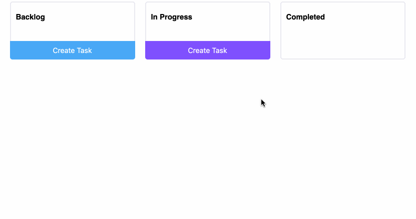

# Do



Do: a verb close to "Dao" which means "The way". A simple kanban board opens many possibilities. To access:

- [Demo](https://shiftyp.github.io/do)
- [Storybook](https://shiftyp.github.io/do/storybook)

## To run (requires node)

```
npm install
// To run the app
npm run start
// To run storybook
npm run storybook
```
